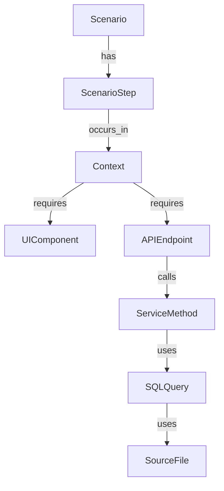

> **CRITICAL: Never use the `memory` MCP tool directly.** All graph reads and writes MUST go
> through the `flow` CLI (`flow graph`, `flow query`, `flow audit`, `flow journal`, etc.).
> The `memory` tool is not available in this workflow. If you cannot find a `flow` command
> for something, use `flow --help` or `flow graph --help` — do not fall back to `memory`.

# Plan Context Skill

Manage and wire **Context** objects in the Memory knowledge graph. Use this skill to resolve `⚠ no context assigned (occurs_in)` warnings from `flow verify` and bridge scenario steps to their UI/API components.

## Context Model

In the planning graph, a **Context** represents the screen, page, modal, or surface where a step occurs.



## Key Facts
- **Branch:** plan/next-gen (see .flow.yml)
- **Object Type:** `Context`
- **Naming Convention:** `ctx-<descriptive-slug>` (e.g., `ctx-contact-list-page`, `ctx-signing-email`)

## Context Properties

| Field | Purpose | Example |
|---|---|---|
| `name` | Short human label for the screen/surface | `"Case Creation Modal"` |
| `description` | Longer description of what this surface shows | `"Modal where the employee fills in..."` |
| `route` | UI URL path for this screen | `"/app/cases/new/{step}"` |
| `component_name` | Templ function name rendered at this route | `"CaseWizardPage"` |

Set all four when creating a Context:

```bash
flow graph create --type Context --key ctx-case-add-modal \
  --properties '{
    "name": "Case Creation Modal",
    "description": "Modal where the employee fills in case details and submits.",
    "route": "/app/cases",
    "component_name": "CaseAddModal"
  }'
```

## Status Lifecycle

Context objects (and all graph objects) follow this status progression:

| Status | Meaning |
|---|---|
| `not_existing` | Never been thought about |
| `in_planning` | Being actively designed right now |
| `planned` | Design complete, ready to implement |
| `needs_update` | Previously implemented but spec has changed in this branch |
| `implemented` | Code written |
| `verified` | Tested and confirmed |

Set status explicitly when creating or updating:

```bash
flow graph update --id <ctx-entity-id> --status planned
```

## Common Workflows

### 1. Fix "no context assigned" Warning
If `flow verify` shows a `⚠` warning for a step:

1. **Find the Step ID:** Get full UUIDs from the scenario's relationships — **do NOT use the truncated IDs shown in `flow verify` output** (they're cut off and will fail):
   ```bash
   flow graph rels <scenario-uuid>
   # dst_id on each "has" relationship is the full step UUID
   ```
2. **Check for existing Context:**
   ```bash
   flow graph list --type Context --json \
     | python3 -c "import sys,json; [print(i['id'],'|',i.get('key',''),'|',i['properties'].get('name','')) for i in json.load(sys.stdin)['items'] if 'keyword' in i['properties'].get('name','').lower()]"
   ```
   Replace `'keyword'` with the screen name you're looking for. Reuse an existing Context if one matches — don't create a duplicate.
3. **Create Context (if missing):**
   ```bash
   CTX_ID=$(flow graph create --type Context --key ctx-my-new-screen \
     --properties '{
       "name": "My New Screen",
       "description": "Description of the UI surface",
       "route": "/app/path/here",
       "component_name": "MyNewScreenPage"
     }')
   echo $CTX_ID
   ```
4. **Wire Step to Context (`occurs_in`):**
   ```bash
   flow graph relate --type occurs_in --from <step-entity-id> --to $CTX_ID
   ```

### 2. Add Components to a Context (`requires`)
To attach a UI component or API endpoint to the surface:

```bash
flow graph relate --type requires --from <context-entity-id> --to <component-entity-id>
```

**Optional Components:** To mark a component as optional (renders as `○` in the tree):
```bash
flow graph relate --type requires --from <context-entity-id> --to <component-entity-id> \
  --properties '{"optional": true}'
```

## Relationship to Action

Each `ScenarioStep` has two siblings: a **Context** (where) and an **Action** (what triggers the next step). They are independent — wire them separately.

```
ScenarioStep
  ├── occurs_in  → Context    ← this skill
  └── has_action → Action     ← see plan-action skill
```

Use the `plan-action` skill to wire the `has_action` relationship.

## Best Practices
- **Reuse:** If multiple steps happen on the same screen (e.g., "Fill form" and "Submit form"), use the same Context object.
- **Background Steps:** For system actions with no UI, use a `ctx-system-*` key or skip the Context if appropriate.
- **Verification:** Always run `flow verify --key <scenario>` after wiring to confirm the tree is updated.

## ⚠️ Check existing UI patterns before creating new contexts

Before creating a new Context (especially for modals and confirmation steps), **check how the project structures the same flow**:

```bash
find <project-ui-dir> -name "*.tsx" -not -path "*/node_modules/*" \
  | xargs grep -l -i "<feature-keyword>" 2>/dev/null
```

A modal often handles multiple steps in one component (e.g., both "click cancel" and "confirm cancel" happen inside the same modal file). If that's the case, use **one Context** for both steps rather than splitting into two.

**Rule of thumb:**
- If steps 2 and 3 are "click button → confirmation appears in the same modal", they share the same Context.
- Only create a separate Context if a truly distinct screen/modal opens (navigation, new route, separate component file).

## ⚠️ Templ files are required for visible UI surfaces

**Every Context whose name contains `tab`, `modal`, `page`, `form`, `list`, `panel`, `view`, `dialog`, `drawer`, `table`, `screen`, or `detail` MUST have at least one UIComponent wired via `requires`.**

A UIComponent represents a **file** (`new_file` or `modify_existing`), not a widget. A single `.templ` file contains all the buttons, tables, checkboxes, and form fields for that screen. The planning question is: *which files need to be created or modified?*

A typical visible Context needs **1–3 UIComponent entries**:
- The `.templ` file for the screen (e.g. `internal/ui/pages/cases/tabs/verifications.templ`)
- The UI handler route file if a new route is needed (e.g. `internal/ui/handler/cases/handler.go`)
- A separate modal `.templ` only if the modal lives in its own file

**Workflow when creating a Context for a visible screen:**
1. Create the Context and wire `occurs_in` from the step.
2. Check what files already exist for this domain:
   ```bash
   ls internal/ui/pages/<domain>/
   flow graph list --type UIComponent
   ```
3. For each file that needs to change, check if a UIComponent already exists for it (reuse if so), otherwise create one:
   ```bash
   UI_ID=$(flow graph create --type UIComponent \
     --key ui-<domain>-<slug> \
     --properties '{"name": "...", "file": "internal/ui/pages/..."}')
   flow graph relate --type requires --from <ctx-id> --to $UI_ID
   ```

The only exception is a `ctx-system-*` context representing a pure backend action with no rendered screen.
