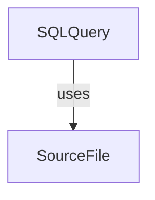

> **CRITICAL: Never use the `memory` MCP tool directly.** All graph reads and writes MUST go
> through the `flow` CLI (`flow graph`, `flow query`, `flow audit`, `flow journal`, etc.).
> The `memory` tool is not available in this workflow. If you cannot find a `flow` command
> for something, use `flow --help` or `flow graph --help` — do not fall back to `memory`.

# plan-source-file

SourceFile represents a migration, schema, or route registration in the Memory graph. It is the leaf node of the component chain.



## Properties
| Property | Required | Description |
|---|---|---|
| `name` | yes | Filename, e.g. `"000011_case_archive.up.sql"` |
| `path` | yes | Relative path, e.g. `internal/db/migrations/000011_case_archive.up.sql` |
| `signature` | no | Route registration line or function signature |

⛔ Do NOT add `domain` — domain is expressed via the Scenario's relationship to a Domain object, not as a property on components.

## Key Naming: `sf-<description>`
- `sf-migration-case-archive`
- `sf-server-employee-avatar-route`
- `sf-employee-upload-avatar-service`

## Common Types
| Type | Path Pattern | Notes |
|---|---|---|
| Migration | `internal/db/migrations/NNNNNN_name.up.sql` | `signature`: nil |
| Server route | `internal/server/server.go` | `signature`: route registration |
| Service file | `internal/service/<domain>.go` | `signature`: func signature |

## Commands
```bash
# Create migration SourceFile (prints entity_id)
SF_ID=$(flow graph create --type SourceFile --key sf-migration-case-archive \
  --properties '{"name": "000011_case_archive.up.sql", "path": "internal/db/migrations/000011_case_archive.up.sql"}')
echo $SF_ID

# Wire SQLQuery → SourceFile (uses)
flow graph relate --type uses --from <sqlquery-id> --to $SF_ID
```

## Workflow

1. **Check for existing SourceFile** — search by `path` property before creating:
   ```bash
    flow graph list --type SourceFile
   ```
   If a SourceFile with the same `path` already exists, **reuse it** — just wire the `uses` relationship from the SQLQuery to the existing object. Do not create a duplicate. SourceFiles (especially migrations and `server.go`) are commonly shared across scenarios.
2. **Create** (only if no match found) using the command above.
3. **Wire** `SQLQuery` → `SourceFile` (`uses`).

## Related
- `plan-sql-query`: The SQLQuery that uses this file.
- `new-sqlc-query`: Writing the actual migration/query.
